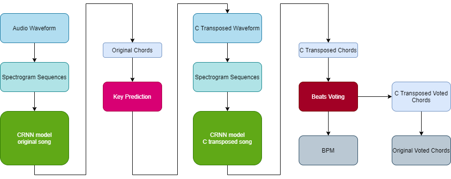

# Song Chords Recognizer - ACR Pipeline

Song Chords Recognizer based on Deep Learning and statistical models coded and [trained](../ACR_Training/ReadMe.md) in Python.

### Prerequisites
 - Python 3.8
 - python libraries - sklearn, tensorflow, librosa, mir_eval
 - [ACR_Training folder](../)


## Usage
### Shell 
```shell
python SongChordsRecognizer.py
```
 - Standard Output -> 
    ```
    [SONG's WAVEFORM IN STRING SEPARATED BY ';']
    [WAVEFORM's SAMPLE RATE]
    ``` 
   - for example,
        ```shell
        0.3215;0.1235;0.6213;-0.941;0.523
        44100
        ```
 - Standard Input -> 
    ```
    {
        "Key": "C",
        "BPM": "120.323",
        "ChordSequence": "['A', 'B', 'A', 'A', 'C']"
    }
    ```


### .NET
```csharp
// Prepare Audio Wav Input
AudioSourceWav wav = new AudioSourceWav(audioBytes, audio.FileName);
string waveform = String.Join(";", wav.GetMonoWaveform());
double sample_rate = wav.SampleRate;

// Initialize Process
ProcessStartInfo python_SongChordRecognizer = new ProcessStartInfo();
python_SongChordRecognizer.FileName = python;

// Prepare command with arguments
python_SongChordRecognizer.Arguments = script;

// Python process configuration
python_SongChordRecognizer.UseShellExecute = false;
python_SongChordRecognizer.CreateNoWindow = true;
python_SongChordRecognizer.RedirectStandardInput = true;
python_SongChordRecognizer.RedirectStandardOutput = true;
python_SongChordRecognizer.RedirectStandardError = true;

// Execute process
string json_response = "";
string errors = "";
using (Process process = Process.Start(python_SongChordRecognizer))
{
    StreamWriter streamWriter = process.StandardInput;
    // Send audio waveform
    streamWriter.WriteLine(waveform);
    // Send sample rate
    streamWriter.WriteLine(sample_rate);
    // Get the output, chord sequence
    json_response = process.StandardOutput.ReadToEnd();
    errors = process.StandardError.ReadToEnd();
}
```


## Structure



### Models

There are two [models](./models/ReadMe.md). The first one is trained on original songs. The second one is trained only on songs transposed to C ionion key and its mode alternatives. The transposed model has better accuracy score.

### Preprocess

Audio waveform is preprocessed to the 23s long sequences of cqt spectrograms.

### Key Prediction

Based on already predicted chords, the key with the most fitting chords is choosed. Each key has seven corresponding chords that are checked.

### Beats Voting

This part uses librosa library to get the BPM value and the Beats list. Each beat duration is summarized and the most common chord si the one mapped to this beat.