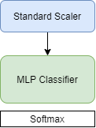
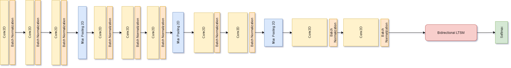
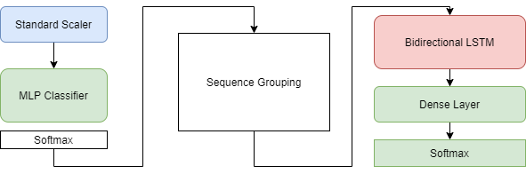
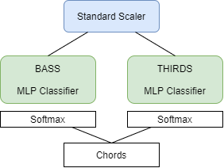
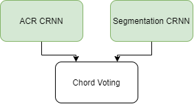
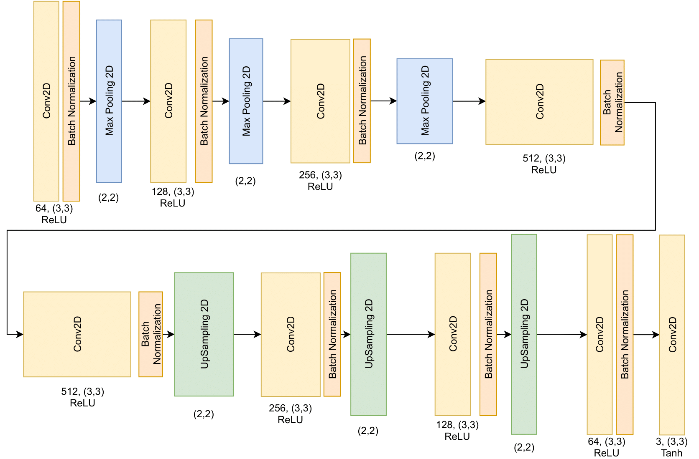

# ACR Training

Automatic Chord Recognition research folder that generates, parses and stores **Datasets** and defines and trains **Models**. This part of the project is coded in Python in order to use specific python libraries.

### Prerequisites

 - Python 3.8
 - python libraries - sklearn, tensorflow, librosa, mir_eval
 - dataset - wav audio, chord annotations, key annotations

## ACR - Results

The ACR training on the Isophonics and Billboard dataset were generated in a Jupyter Notebook. You can see the outcome [HERE!](./Bachelor%20Research%20-%20ACR.ipynb)

Model descriptions are listed [BELOW.](#acr-models---structures)

## Segmentation - Results

In order to increase accuracy of the ACR, the harmony segmentation is researched.
The Segmentation results were generated in a Jupyter Notebook. You can see the outcome [HERE!](./Bachelor%20Research%20-%20Segmentation.ipynb)

Basicaly, segmentation models are opportunity for the future works. For now, the librosa's beat track, which returns bpm with beat list, is used.

Model descriptions are listed [BELOW.](#segmentation-models---structures)

## Datasets

Two well known datasets are included.
- [Isophonics](http://isophonics.net/datasets) (225 songs) - This one is used as a training dataset.
- [Billboard](https://ddmal.music.mcgill.ca/research/The_McGill_Billboard_Project_(Chord_Analysis_Dataset)/) (890 songs)

### Dataset issues
 1. No audio files provided.
 1. Not consistent chord annotations - sometimes B chord means Hes, sometimes B chord means H.
 1. Sometimes not correctly annotated chords (Something by Beatles).
 1. When the audio files exist, the dataset is too large.

## Preprocessing

Datasets have functions for data preprocessing. The audio waveform is parsed and the spectrogram/chromagram is generated. Each model type needs different kind of preprocessing. 

### MLP Preprocessing

The function will generate the moving window of spectrograms flattened as a one feature set. Optionally, data can be transposed to C major key (and its mode alternatives).

### CRNN Preprocessing

The function will generate the sequence of spectrograms as a one feature set.Optionally, data can be transposed to C major key (and its mode alternatives).

## ACR Models - structures

### MLP with Scaler

### CRNN

### MLP -> RNN

### Bass Vs Third

### Segmentation Voting

## Segmentation Models - structures

### Segmentation CRNN

### Encoder-Decoder Segmentation
