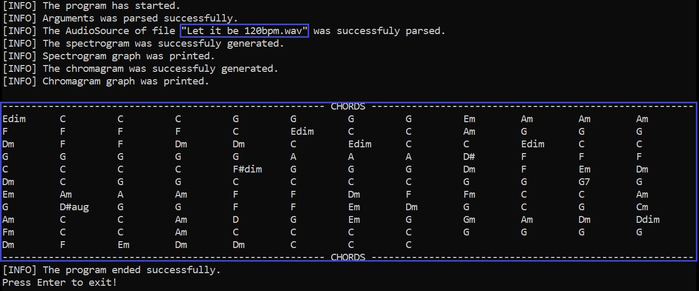
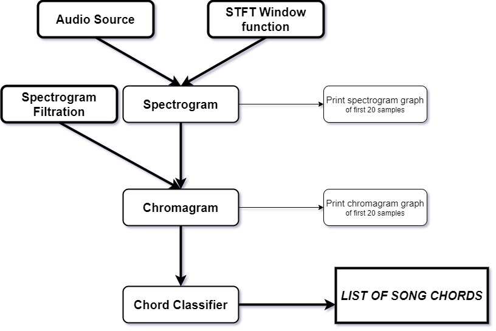
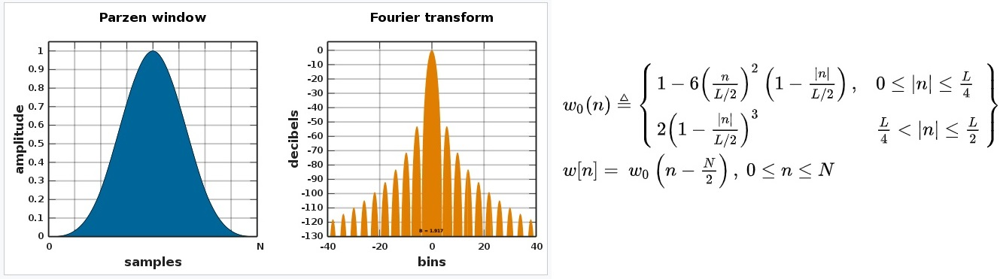

# Song Chords Recognizer    

1) Have you ever heard a **song** on YouTube or the radio
that you would like to **play on guitar and sing** with your friends? 

2) Is there some **song** you like and you want to play it **for yourself** or **improvise** on it **with your music friends**?

3) Are you trying to create **sheet music** for a specific **song** for your **band**?

**CHORDS and HARMONY analysis is a very good start!!** - And that is exactly what this application offers.


## Usage
*Via Command Prompt:*

```batch
start SongChordsRecognizer.exe [path of audio file] [STFT window type] [Spectrogram filtration type] [One Chord length level]
```
*Try it Yourself with the demo in **./docs/demo** folder*.

 - [Path of audio file](##Supported-audio-format): String, path (relative or absolute) of audio file.
 - [STFT window types](##STFT-Window-types) : {```Rectangular```, ```Triangular```, ```Parzen```, ```Welch```, ```Nuttall```}
 - [Spectrogram filtration types](##Spectrogram-filtration-types) : {```Identity```, ```AFAM```, ```WO```, ```FNH```}
 - [One Chord / Sample length level](##Sample-Length-Level) : non negative integer



#### examples:
```batch
start SongChordsRecognizer.exe "Summertime.wav" "Triangular" "Identity" 15
```

```batch
start SongChordsRecognizer.exe "Summer.wav" "Parzen" "AFAM" 14
```

```batch
start SongChordsRecognizer.exe "Summer samba.wav" "Welch" "WO" 16
```


## Algorithm


#### ***Spectrogram***
A spectrogram is a graph that contains the intensity of each frequency played during some music sample.
The algorithm takes the audio wave data and the function of STFT window that is applied on the given sound wave.
The modified sound wave will be passed to a Fast Fourier Transform and its outcome will form a spectrogram. 

#### ***Chromagram***
A chromagram is a graph that contains the intensity of each chroma played during some music sample.
There are twelve chroma: C, C#, D, D#, E, F, F#, G, G#, A, A#, B.
The chromagram is generated from a filtered spectrogram.
Thus, a spectrogrma and filtration are required.
Filtered spectrogram peaks, which correspond to tone pitches, are averaged over all octaves.
Averaged result forms the chromagram.

#### ***Chord Classification***
This section classifies chords that correspond to the harmony played in the given chromagram. 
At first, all triad chords are considered ( diminished, minor, major and augmented for each chroma ).
The most likely triad chord is the one with the highest value of the multiple of the normalized intensity of the root, third and fifth tones.
The value is also multiplied by 2 if the triad fifth is perfect fifth to increase chances for more "normal" chords". 
The same thing happens with seventh chords.
If there is a seventh chord with the same root, third and fifth tones as the most likely triad and with that multiplied value higher than 0.6, the most likely seventh chord is used.
Otherwise, the most likely triad chord is choosed.

## Supported audio format
So far, this project only supports **.WAV** audio files.

File requirements:
- The number of bits per waveform sample has to be **divisible** by **8**.
- There must be **'fmt'** and **'data'** subchunks.

## STFT Window types 
STFT Window is a function that is applied on waveform and modifies its shape.
We are using it in order to have Fourier Transform more accurate.

There are several window functions that this project supports:
#### ***Rectangular window***

#### ***Triangular window***

#### ***Parzen window***

#### ***Welch window***

#### ***Nuttall window***


## Spectrogram filtration types
Every music recording has a lot of noise that we have to suppress.
Furthermore, instruments also generate nth multiples of played tones.
So Spectrogram shows us more tones than were actually played. 

For this purpose, we have several types of how to clean the spectrogram a bit:

#### ***Identity***
Filtering that doesn't do any of filtration. It will just return default spectrogram. 

#### ***Accompaniment Frequency Area Mask***
When we are interested only in the chord recognition, there is only one area of tones that is intendet to accompaniment creation (in other words .. to harmony creation).
This region begins cca at the end of the Great octave, and the region ends cca in the middle of the One lined octave.
This filtering creates a mask and allows the same values for this area.
The rest of the frequencies will be set on zero. 

*(Zero values are explicitly ignored by chromagram averaging!)*

#### ***Weighted Octaves***
Basically, we have three (four) types of tones: 

 0) **Beats**, ect..
 1) **Bass** - Bass tones are very interesting for chord, because it always specifies the root tone of chord. But sometimes these tones could be misleading, for instance in much more complex basslines like walking bass in Jazz, ect...
 2) **Harmony** - Harmony is the most interesing area. That area directly represents chords. 
 3) **Melody** - Melody is not that interesting for single chords. There could be passages that are not part of our chord. On the other hand, the melody is always based on a harmony. 

So it is a good idea to weight single octave tones by their "chord importance". For instance, great, small and one lined octaves are
much more important than the rest of them.

The WeightedOctaves class includes **SetWeight(int octave,double weight):void**.
You can change weights through this function.

#### ***Filter Nth Harmonics***
*Filtration was described in [Christoph Hausner's Bachelor Thesis](https://www.fim.uni-passau.de/fileadmin/dokumente/fakultaeten/fim/lehrstuhl/sauer/geyer/BA_MA_Arbeiten/BA-HausnerChristoph-201409.pdf).*

This algorithm filter spectrogram from nth harmonics which are generated by instruments.
That means that if the tone of frequency F is played, then it is also reflected on frequencies 'F * n' for n = 1,2,3,....

This filtration takes the minimum of spectrogram[i][j * n] * (1/epsilon)^{n-1} for n = 1,2,3,...,n_harmonics.

By default epsilon=0.4 and n_harmonics=10.

*( [Gomez 2006] Tonal description of polyphonic audio for music content processing. )*

## Sample Length Level

This argument specifies length of STFT part in Fourier Transform. One spectrogram sample -> One chromagram sample -> One chord duration ... all these are based on STFT. 
Thus, this argument also specifies the length of chord duration, spectrogram sample and chromagram sample.

Length in seconds of one sample (STFT, Spectrogram, Chromagram or also Chord) is computed according to the following formula:

**length_in_seconds** = (2^(SampleLengthLevel)) / (SampleRate)

|SampleLengthLevel|SampleRate|sample/chord length in seconds|
|---|---|---|
| 10  | 44100  | 0.02322  |
| 11  | 44100  | 0.04644  |
| 12  | 44100  | 0.09288  |
| 13  | 44100  | 0.18576  |
| 14  | 44100  | 0.37152  |
| 15  | 44100  | 0.74304  |
| 16  | 44100  | 1.48608  |
| 17  | 44100  | 2.97215  |
| 18  | 88200  | 2.97215  |


