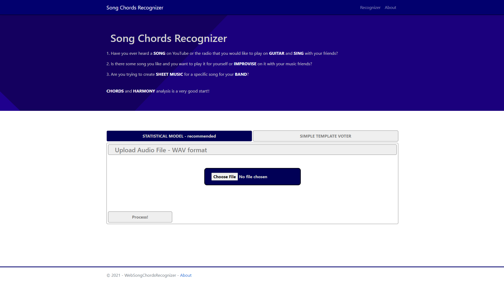
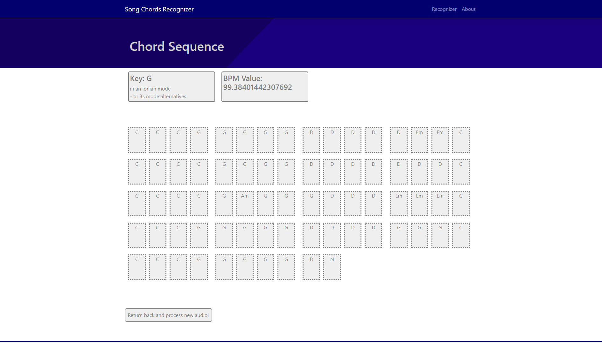

# Song Chords Recognizer - Web ASP.NET Application

## Recognizer Controller

#### ***/index***

Default index page where you can upload and process and audio file with any of provided models.

- Method: GET
- Arguments: None

#### ***/VisualizeStatisticalModel***
Outcome of [Song Chords Recognizer](../ACR_Pipeline/ReadMe.md) based on Deep Learning with its key and bpm.

- Method: POST
- Arguments: IFormFile audio

#### ***/VisualizeTemplateVoter***
Outcome of [Song Chords Recognizer](./SongChordsRecognizer/ReadMe.md) based on simple template voting from generated and filtrated spectrogram.

- Method: POST
- Arguments: IFormFile audio, String windowArg, String filtrationArg, int sampleLengthLevel, int bpm

#### ***/About***
Basic information about the project with the GitHub link.

- Method: GET
- Arguments: None

#### */IncorrectInputFormat*
Error message when some error occures.

- Method: GET
- Arguments: String messages

