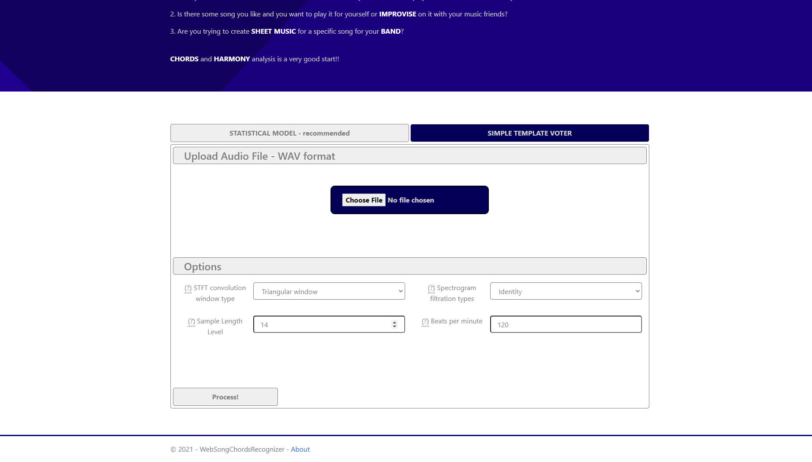
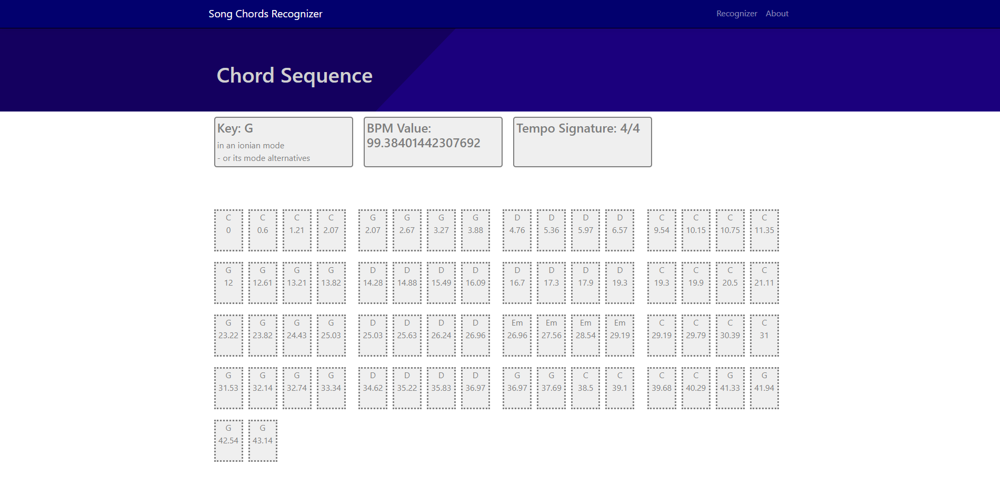
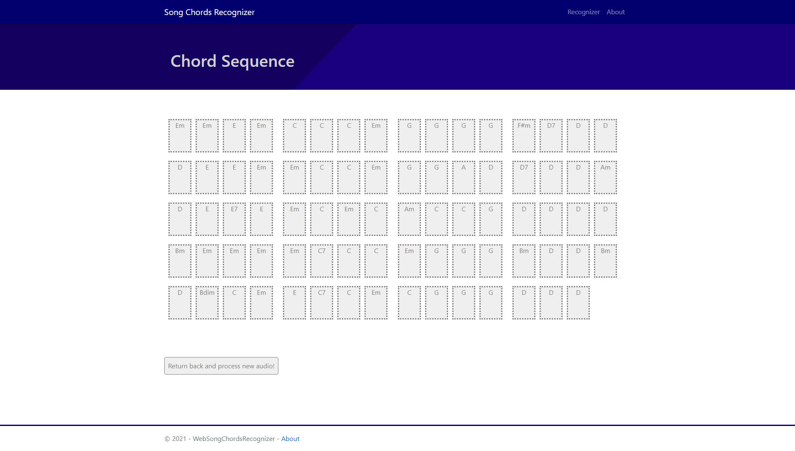
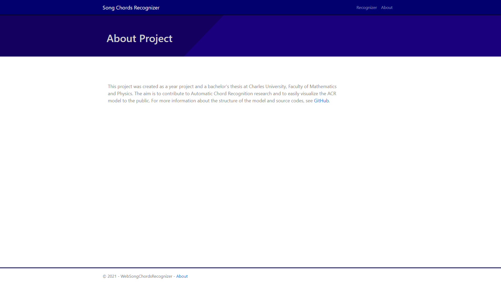
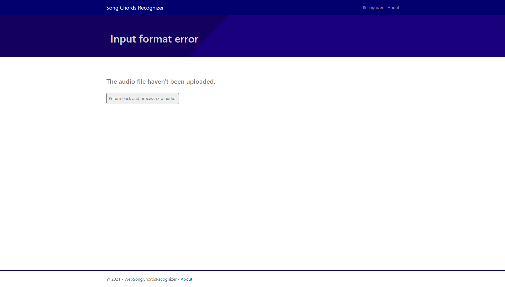

# Song Chords Recognizer - Web ASP.NET Application

## Configuration
Edit ```appsettings.json``` config file.

!! Fill the ```Predictors.PythonPath``` parameter by the path to your python.exe !!

Other parameters are optional.


## Recognizer Controller

#### ***/index***

Default index page where you can upload and process an audio file with any of provided models.

- Method: GET
- Arguments: None





#### ***/VisualizePredictors***
Outcome of [Song Chords Recognizer](../ACR_Pipeline/ReadMe.md) model based on Deep Learning with its key and bpm.

- Method: POST
- Arguments: IFormFile audio




#### ***/VisualizeTemplateVoter***
Outcome of [Song Chords Recognizer](./SongChordsRecognizer/ReadMe.md) model based on the simple template voting from generated and filtered spectrograms.

- Method: POST
- Arguments: IFormFile audio, String windowArg, String filtrationArg, int sampleLengthLevel, int bpm




#### ***/About***
Basic information about the project with the GitHub link.

- Method: GET
- Arguments: None




#### */IncorrectInputFormat*
An error message when some error occures.

- Method: GET
- Arguments: String messages



