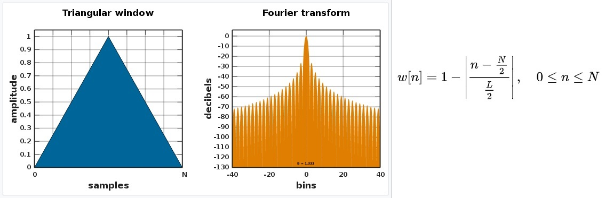
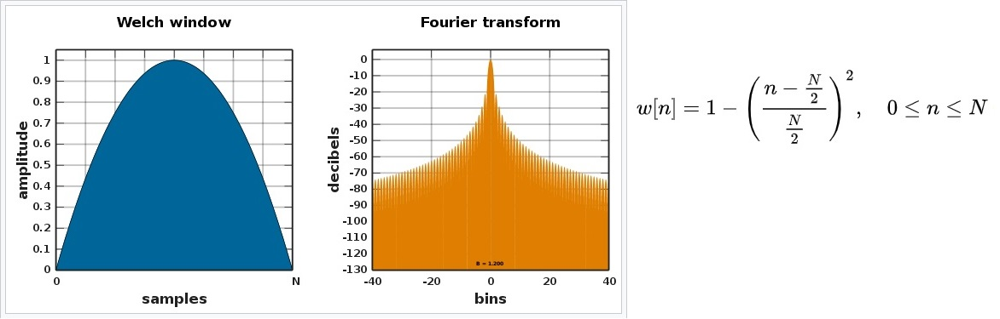

# Song Chords Recognizer - Template Voter

Song Chords Recognizer based on the simple chord template voting coded in C# .

### Prerequisites
 - .NET 5.0
 - WAV audio file
 - Information about the BPM value


## Usage

At first you need to initialize

 1. [Audio File](#supported-audio-format)
 2. [STFT Window types ](#stft-window-types)
 3. [Spectrogram filtration types](#spectrogram-filtration-types)
 4. [Sample Length Level](#sample-length-level)
 5. [BPM value](#bpm-value)

Then you can use the Song Chord Recognizer pipeline as follows.

```csharp
// Parse audio data
AudioSourceWav wav = new AudioSourceWav(audioBytes, audio.FileName);
// Generate SPECTROGRAM
Spectrogram spectrogram = new Spectrogram(wav, sampleLengthLevel, window);
// Generate CHROMAGRAM
Chromagram chromagram = new Chromagram(spectrogram, filtration);
// Classify chords
List<Chord> chordSequence = ChordClassifier.GetChords(chromagram, bpm);

return chordSequence;
```


## Structure


#### ***Spectrogram***
A spectrogram is a graph that contains the intensity of each frequency played during some music sample. The algorithm takes the audio wave data and the function of STFT window that is applied on the given sound wave. The modified sound wave will be passed to a Fast Fourier Transform and its outcome will form a spectrogram.

#### ***Chromagram***
A chromagram is a graph that contains the intensity of each chroma played during some music sample. There are twelve chromas: C, C#, D, D#, E, F, F#, G, G#, A, A#, B. The chromagram is generated from a filtered spectrogram. Thus, a spectrogrma and filtration are required. Filtered spectrogram peaks, which correspond to tone pitches, are averaged over all octaves. Averaged result forms the chromagram.

#### ***Chord Classification***
This section classifies chords that correspond to the harmony played in the given time frame. The BPM value specifies those time frames as a duration between two beats. All chromagram samples corresponding to that duration are summed together. We prepared all triad and seventh chord templates, and the classifier is designed to choose the one that fits the most. At first, all triad chords are considered, i.e., diminished, minor, major, and augmented, for each root tone. The most likely triad chord is the one with the highest value of the product of root, third and fifth tone intensities normalized to scale between one and zero. In case the triad fifth is a perfect fifth, we multiply the result by two to increase chances for more intuitive and statistically more common chords - major and minor. The same selecting algorithm is processed with seventh chords. If there is a seventh chord with the same root, third and fifth tones as the most likely triad and with the score, i.e., the intensity product, higher than 0.6, the most likely seventh chord is used. Otherwise, the most likely triad chord is selected. This heuristic helps us in prioritizing triad chords. The seventh chord is considered if it has a solid score.

## Supported audio format
So far, this project only supports **.WAV** audio files.

File requirements:
- The number of bits per waveform sample has to be **divisible** by **8**.
- There must be **'fmt'** and **'data'** subchunks.

## STFT Window types
STFT Window is a function that is applied on waveform and modifies its shape.
We are using it in order to have Fourier Transform more accurate.

There are several window functions that this project supports:
#### ***Rectangular window***

#### ***Triangular window***

#### ***Parzen window***

#### ***Welch window***

#### ***Nuttall window***


## Spectrogram filtration types
Every music recording has a lot of noise that we have to suppress.
Furthermore, instruments also generate nth multiples of played tones.
So Spectrogram shows us more tones than were actually played.

For this purpose, we have several types of how to clean the spectrogram a bit:

#### ***Identity***
Filtering that doesn’t do any of filtration. It will return default spectrogram as it is generated by STFT

#### ***Accompaniment Frequency Area Mask***
When we are interested only in chord recognition, there is only one area of tones that is intended for accompaniment creation, in other words, harmony creation. This range of harmony part begins somewhere at the end of the great octave and ends somewhere in the middle of the one-lined octave. This filtering creates a mask and allows only values in this area. The rest of the frequencies are set to zero. Because of that, chromagram creation would not work well for the inconsistency of valued octaves of each chroma. Therefore, the chromagram generation algorithm explicitly ignores zero values.

*(Zero values are explicitly ignored by chromagram averaging!)*

#### ***Weighted Octaves***
Basically, we have four types of tones:

 1) **Beats**
 2) **Bass** - Bass tones are essential for chords because it always specifies the root tone of the chord. But sometimes, these tones could be misleading, for instance, much more complex bass lines like walking bass in jazz, etc.
 3) **Harmony** - Harmony is the area we are interested in the most, which directly represents chords.
 4) **Melody** - Melody is not that interesting for single chords. There could be passages that are not part of our chord. On the other hand, the melody is always based on harmony.

So it is a good idea to weigh single octave tones by their importance in the ACR. For instance, great, small, and one-lined octaves are much more important than the rest of them. Users can set weight values on their own or use the default settings.

The WeightedOctaves class includes **SetWeight(int octave,double weight):void**.
You can change weights through this function.

#### ***Filter Nth Harmonics***
Filtration was proposed by Hausner [2014]. This algorithm filters spectrogram from n-th harmonics, so-called aliquotes, which are automatically generated by instruments. The filtration iterates over all spectrogram values and each will be rewritten by a minimum of

*spectrogram[i][j * n] * (1/epsilon)^{n-1}*

for integer n∈[1, n harmonics]. The epsilon and the n harmonics are defaultly set to epsilon=0.4 and n harmonics=10.

## Sample Length Level
***We strongly recommend using a value of 14 or 15.***

This argument specifies length of STFT part in Fourier Transform. One spectrogram sample -> One chromagram sample ... all these are based on STFT.
Thus, this argument also specifies the length of spectrogram sample and chromagram sample.
Chords are generated for each beat (according to the [BPM value](#bpm-value)) from chromagram samples corresponding to the same time.

Length in seconds of one sample (STFT, Spectrogram or Chromagram) is computed according to the following formula:

**length_in_seconds** = (2^(SampleLengthLevel)) / (SampleRate)

|SampleLengthLevel|SampleRate|sample length in seconds|
|---|---|---|
| 10  | 44100  | 0.02322  |
| 11  | 44100  | 0.04644  |
| 12  | 44100  | 0.09288  |
| 13  | 44100  | 0.18576  |
| 14  | 44100  | 0.37152  |
| 15  | 44100  | 0.74304  |
| 16  | 44100  | 1.48608  |
| 17  | 44100  | 2.97215  |
| 18  | 88200  | 2.97215  |


## BPM value
Beats per minute, how many beats are included in one minute. The range of this value is between 20 (Larghissimo) and 220 (Prestissimo).

Each song has different bpm value. You have to find out this value separately.